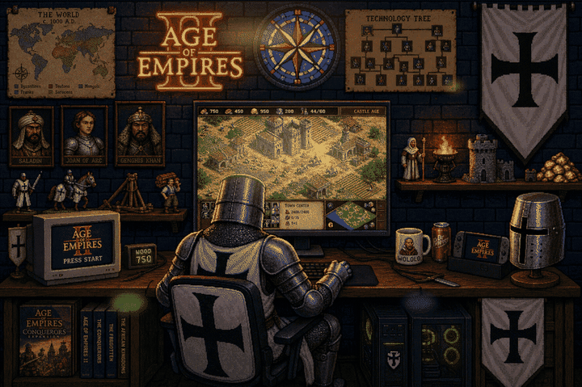

# Age of Empires Gaming Room

Animated pixel-art battlestation (GIF) — Age of Empires II / **Teutonic Knight** remake of the classic Mario coder header.

<p align="center">
  
</p>

<p align="center">
  
</p>

### Use in your GitHub profile README

```markdown

```

Or after merge to `main`:

```markdown

```

### What’s animated
- Neon Age of Empires II logo pulse
- Monitor / CRT flicker
- PC LED blink
- Soft gold sparkle + breathing light

### Theme
- Seated character: **Teutonic Knight** (AoE2) — replaces Mario
- Castle Age isometric town on the main screen
- Teutonic banners, great helm, WOLOLO mug, tech tree & map posters
