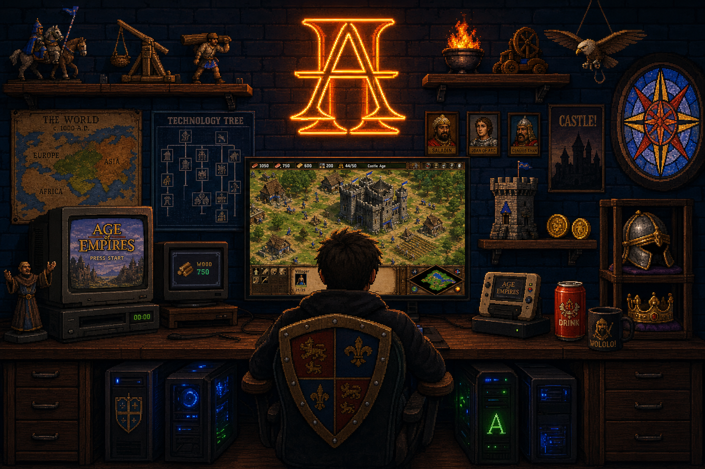

# Age of Empires Gaming Room

Pixel-art cozy battlestation remake themed around **Age of Empires** — same layout energy as the classic Nintendo gaming-room scene, swapped for medieval RTS vibes.

  

### Theme swaps
- Neon **AoE “A”** logo glow
- Main monitor: Castle Age isometric town + classic RTS UI
- CRT: Age of Empires title / Press Start
- Figurines: knight, trebuchet, wood-carrying villager, monk
- Posters: world map c. 1000 A.D., technology tree, CASTLE!
- Chair cushion: heraldic shield · desk hat rack: crown / helmet
- Stained-glass compass rose window · WOLOLO mug
